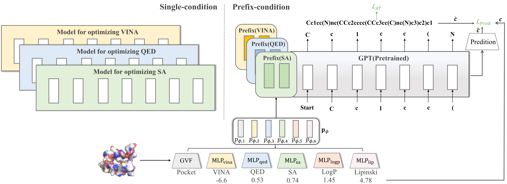

# PrefixMol: Target- and Chemistry-aware Molecule Design via Prefix Embedding

## 📢 News
  - Code: https://github.com/ALEEEHU/MolDesign
  - Paper: https://arxiv.org/abs/2302.07120


We propose PrefixMol, inserting learnable conditional feature vectors into the attention module to unify multi-conditional molecule generative models to support the modeling of customized requirements.

## Installation

### Dependency
The codes have been tested in the following environment:
Package  | Version
--- | ---
Python | 3.7.12
PyTorch | 1.10.0
CUDA | 11.3.1
PyTorch Geometric | 2.0.3
RDKit | 2021.09.4 

### Install via conda yaml file (cuda 11.3)
```bash
conda env create -f env.yml
conda activate PrefixMol
```

### Install manually

``` bash
conda create -n PrefixMol python=3.7.12
conda activate PrefixMol

# Install PyTorch (for cuda 11.3)
conda install pytorch==1.10.0 cudatoolkit=11.3 -c pytorch -c conda-forge
# Install PyTorch Geometric (>=2.0.0)
conda install pyg -c pyg

# Install other tools 
# conda install
conda install -c conda-forge rdkit
conda install -c conda-forge openbabel
conda install pyyaml easydict python-lmdb -c conda-forge
# pip install
pip install nni
pip install deepchem
pip install partialsmiles
pip install transformers

```

<details><summary>🔎 Tips for pytorch3d installation</summary>
Notice that we recommend using the following steps to install pytorch3d!
1. install the following necessary packages.
``` 
conda install -c fvcore -c iopath -c conda-forge fvcore iopath
```
2. Find the suitable version with your environment https://github.com/facebookresearch/pytorch3d/releases
3. Git clone the resporitory and then run the command as follows for example.

``` bash
cd pytorch3d
python setup.py install
```
</details>


## Datasets

Please refer to [`README.md`](./data/README.md) in the `data` folder.

## Training
We used DDP(https://pytorch.org/docs/stable/generated/torch.nn.parallel.DistributedDataParallel.html?highlight=distributeddataparallel#torch.nn.parallel.DistributedDataParallel) to accelerate the training process. Here are some command examples FYR.

```bash
# 4 GPUs
CUDA_VISIBLE_DEVICES="0,1,2,3" python -m torch.distributed.launch --nproc_per_node 4 train.py
# 8 GPUs
CUDA_VISIBLE_DEVICES="0,1,2,3,4,5,6,7" python -m torch.distributed.launch --nproc_per_node 8 train.py

```

## Testing

```
python train.py --config ./configs/train.yml --logdir ./logs
```

## Tips
When running the codes, the path where the code appears is recommended to be changed to the path you need at the moment.

## Citation
```
@article{gao2023prefixmol,
  title={PrefixMol: Target-and Chemistry-aware Molecule Design via Prefix Embedding},
  author={Gao, Zhangyang and Hu, Yuqi and Tan, Cheng and Li, Stan Z},
  journal={arXiv preprint arXiv:2302.07120},
  year={2023}
}
```

## Contact 
Zhangyang Gao (gaozhangyang@westlake.edu.cn)
Yuqi Hu (hyqale1024@gmail.com)

